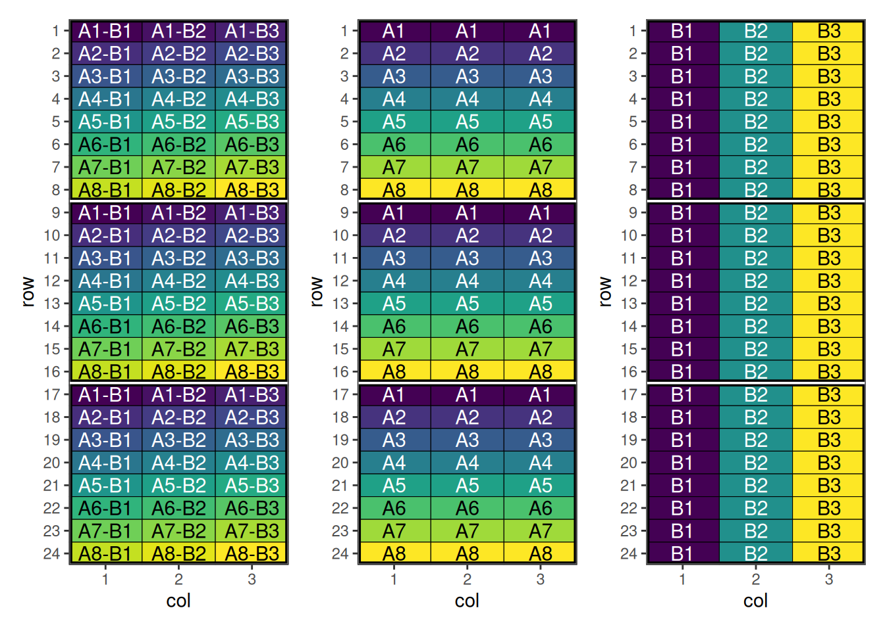
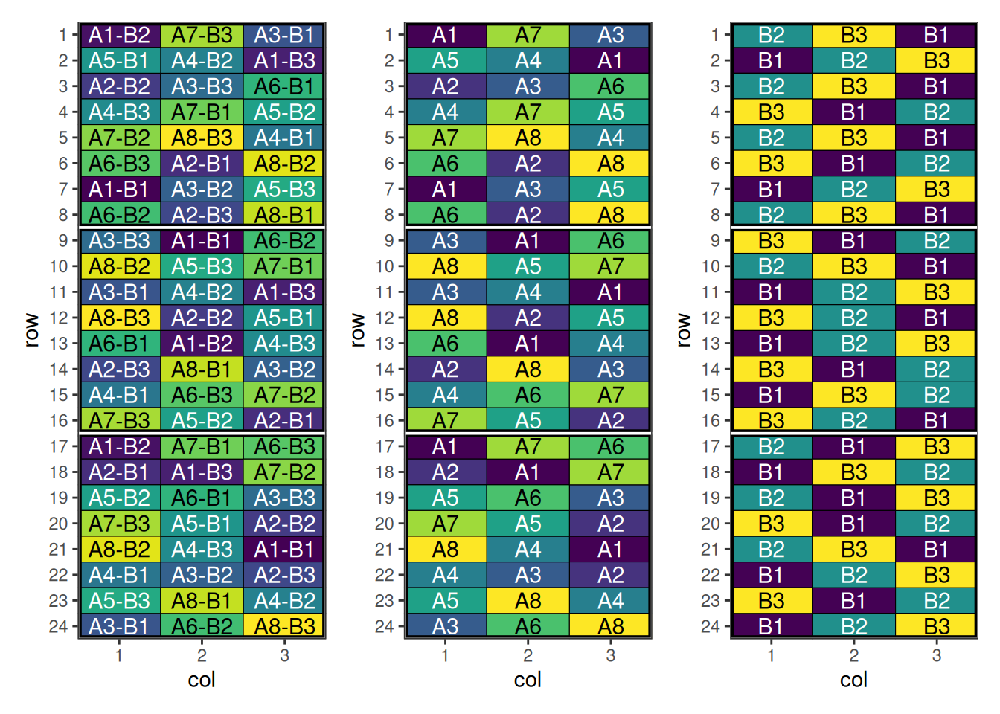

# Factorial Design with speed

## Factorial Design

### Overview

Factorial designs are experimental designs used to study the effects of
two or more factors simultaneously. They allow estimation of main
effects and interactions between factors, making them efficient and
informative.

``` r
library(speed)
library(patchwork)
```

### When to Use

- Studying multiple factors at the same time
- Detecting interactions between factors
- Efficient use of experimental units

### Setting Up Factorial Design with speed

Now we can create a data frame representing a factorial design. Note
that the treatment column we are creating is the interaction (or
combination) of the individual treatments.

``` r
treatment_a <- paste0("A", 1:8)
treatment_b <- paste0("B", 1:3)
treatments <- with(expand.grid(treatment_a, treatment_b), paste(Var1, Var2, sep = "-"))
factorial_design <- initialise_design_df(treatments, 24, 3, 8, 3)

head(factorial_design)
```

      row col treatment row_block col_block block
    1   1   1     A1-B1         1         1     1
    2   2   1     A2-B1         1         1     1
    3   3   1     A3-B1         1         1     1
    4   4   1     A4-B1         1         1     1
    5   5   1     A5-B1         1         1     1
    6   6   1     A6-B1         1         1     1

Plotting these factors shows the initial layout of the interaction and
main effects.



#### Performing the Optimisation

For factorial designs, speed provides a customised objective function
`objective_function_factorial`. The `optimise_params` argument is also
used in this case to adjust the optimisation strategy due to the
difficulty of optimising such designs.

Make sure `factorial_separator` matches how you constructed the
interaction treatment (here we used `"-"`). If your treatments use a
different separator (e.g. `"A1:B2"`), pass `factorial_separator = ":"`.

``` r
factorial_result <- speed(
  data = factorial_design,
  swap = "treatment",
  swap_within = "block",
  spatial_factors = ~ row + col,
  obj_function = objective_function_factorial,
  optimise_params = optim_params(random_initialisation = 50, adaptive_swaps = TRUE),
  early_stop_iterations = 10000,
  iterations = 200000,
  seed = 112
)
```

    row and col are used as row and column, respectively.

    Optimising level: single treatment within block
    Level: single treatment within block Iteration: 1000 Score: 29.75155 Best: 29.75155 Since Improvement: 19
    Level: single treatment within block Iteration: 2000 Score: 20.26708 Best: 20.26708 Since Improvement: 150
    Level: single treatment within block Iteration: 3000 Score: 16.98137 Best: 16.98137 Since Improvement: 198
    Level: single treatment within block Iteration: 4000 Score: 16.78261 Best: 16.78261 Since Improvement: 718
    Level: single treatment within block Iteration: 5000 Score: 14.86957 Best: 14.86957 Since Improvement: 191
    Level: single treatment within block Iteration: 6000 Score: 14.12422 Best: 14.12422 Since Improvement: 578
    Level: single treatment within block Iteration: 7000 Score: 14.12422 Best: 14.12422 Since Improvement: 1578
    Level: single treatment within block Iteration: 8000 Score: 14.12422 Best: 14.12422 Since Improvement: 2578
    Level: single treatment within block Iteration: 9000 Score: 14.12422 Best: 14.12422 Since Improvement: 3578
    Level: single treatment within block Iteration: 10000 Score: 14.12422 Best: 14.12422 Since Improvement: 4578
    Level: single treatment within block Iteration: 11000 Score: 14.12422 Best: 14.12422 Since Improvement: 5578
    Level: single treatment within block Iteration: 12000 Score: 14.12422 Best: 14.12422 Since Improvement: 6578
    Level: single treatment within block Iteration: 13000 Score: 14.12422 Best: 14.12422 Since Improvement: 7578
    Level: single treatment within block Iteration: 14000 Score: 14.12422 Best: 14.12422 Since Improvement: 8578
    Level: single treatment within block Iteration: 15000 Score: 14.12422 Best: 14.12422 Since Improvement: 9578
    Early stopping at iteration 15422 for level single treatment within block 

``` r
factorial_result
```

    Optimised Experimental Design
    ----------------------------
    Score: 14.12422
    Iterations Run: 15423
    Stopped Early: TRUE
    Treatments: A1-B1, A1-B2, A1-B3, A2-B1, A2-B2, A2-B3, A3-B1, A3-B2, A3-B3, A4-B1, A4-B2, A4-B3, A5-B1, A5-B2, A5-B3, A6-B1, A6-B2, A6-B3, A7-B1, A7-B2, A7-B3, A8-B1, A8-B2, A8-B3
    Seed: 112 

#### Output of the Optimisation

The output summarises the optimisation of the factorial **interaction**
treatment (e.g. `"A1-B2"`) across the spatial layout. The reported score
is for the whole design after optimisation, and the returned `design_df`
contains the updated treatment allocation.

Because the treatment column encodes multiple factors, it can be helpful
to split it back into its component factors (e.g. `treatment_a` and
`treatment_b`) when inspecting the result. This lets you check whether
the optimisation improved not only the interaction layout, but also the
balance/adjacency patterns of the main effects.

``` r
str(factorial_result)
```

    List of 8
     $ design_df     :Classes 'design' and 'data.frame':    72 obs. of  8 variables:
      ..$ row        : int [1:72] 1 1 1 2 2 2 3 3 3 4 ...
      ..$ col        : int [1:72] 1 2 3 1 2 3 1 2 3 1 ...
      ..$ treatment  : chr [1:72] "A1-B2" "A7-B3" "A3-B1" "A5-B1" ...
      ..$ row_block  : num [1:72] 1 1 1 1 1 1 1 1 1 1 ...
      ..$ col_block  : num [1:72] 1 1 1 1 1 1 1 1 1 1 ...
      ..$ block      : num [1:72] 1 1 1 1 1 1 1 1 1 1 ...
      ..$ treatment_a: chr [1:72] "A1" "A1" "A1" "A2" ...
      ..$ treatment_b: chr [1:72] "B1" "B2" "B3" "B1" ...
      ..- attr(*, "out.attrs")=List of 2
      .. ..$ dim     : Named int [1:2] 24 3
      .. .. ..- attr(*, "names")= chr [1:2] "row" "col"
      .. ..$ dimnames:List of 2
      .. .. ..$ row: chr [1:24] "row= 1" "row= 2" "row= 3" "row= 4" ...
      .. .. ..$ col: chr [1:3] "col=1" "col=2" "col=3"
     $ score         : num 14.1
     $ scores        : num [1:15423] 79.7 87.2 84.6 88.4 87.1 ...
     $ temperatures  : num [1:15423] 100 99 98 97 96.1 ...
     $ iterations_run: num 15423
     $ stopped_early : logi TRUE
     $ treatments    : chr [1:24] "A1-B1" "A1-B2" "A1-B3" "A2-B1" ...
     $ seed          : num 112
     - attr(*, "class")= chr [1:2] "design" "list"

#### Visualise the Output

``` r
treatments <- strsplit(as.character(factorial_result$design_df$treatment), "-") |>
  unlist() |>
  matrix(ncol = 2, byrow = TRUE)
factorial_result$design_df[c("treatment_a", "treatment_b")] <- treatments

pa <- autoplot(factorial_result, treatments = "treatment_a")
pb <- autoplot(factorial_result, treatments = "treatment_b")
p <- autoplot(factorial_result)
p + pa + pb + plot_layout(ncol = 3)
```



This design has now been optimised for both main and interaction
effects.

## Spatial Design Considerations

### Field Shape and Orientation

### Neighbour Effects

## Using `speed` Effectively

1.  **Set appropriate parameters**: Balance optimisation time with
    improvement
2.  **[Visualise
    designs](https://biometryhub.github.io/speed/articles/autoplot.md)**:
    Always plot layouts before implementation
3.  **Compare alternatives**: Test multiple blocking strategies
4.  **Validate results**: Check constraint satisfaction and efficiency
    factors

## Conclusion

### Further Reading

## Related Vignettes

*This vignette demonstrates the versatility of the `speed` package for
agricultural experimental design. For more advanced applications and
custom designs, consult the package documentation and additional
vignettes.*
