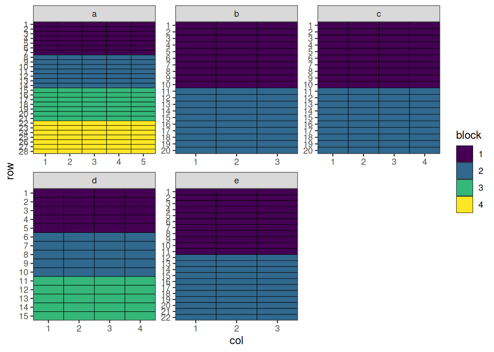
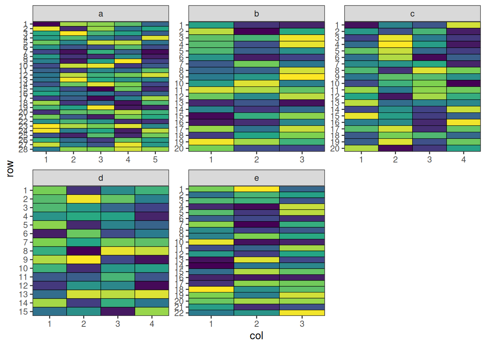
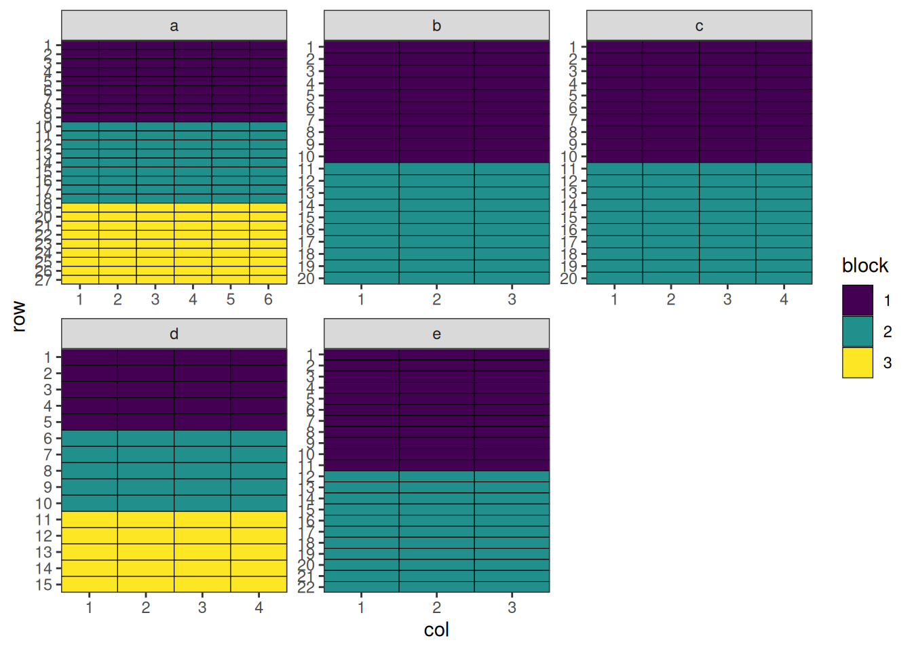
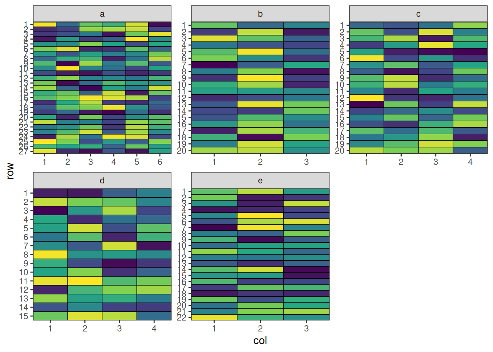
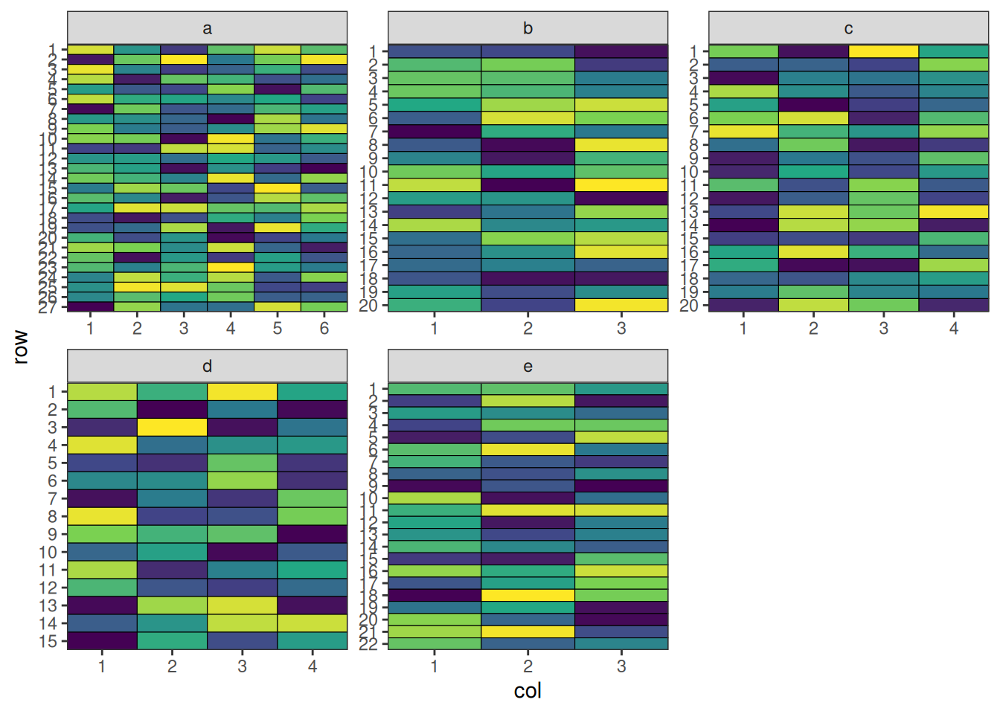
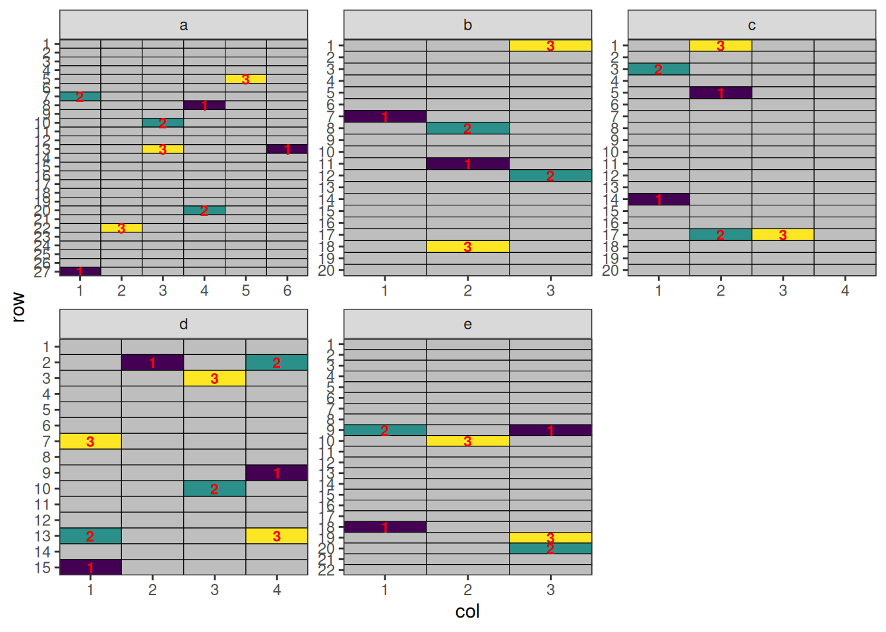

# Multi-Environment Trials with speed

## MET Design

### Overview

Multi-environment trials (MET) are experimental designs used to evaluate
the performance of treatments across different environments. An
environment typically represents a unique combination of location, year,
season, or management practice. MET designs are essential for
understanding genotype × environment (G×E) interactions, stability, and
adaptability of treatments under different conditions.

``` r
library(speed)
```

### When to Use

- Treatment evaluation across multiple locations and/or years
- Crop breeding and regional recommendation trials
- Testing stability and adaptability
- When results are intended for large geographic areas

### Structure

- **Sites**: Different locations of the trial
- **Site-blocks**: Blocks within sites

## Optimising Allocation across All Sites

### Setting Up MET Design with speed

Now we can create a data frame representing a MET design. Note that we
can specify different dimensions for each site in the `designs`
argument.

``` r
all_treatments <- c(rep(1:50, 7), rep(51:57, 8))
met_design <- initialise_design_df(
  items = all_treatments,
  designs = list(
    a = list(nrows = 28, ncols = 5, block_nrows = 7, block_ncols = 5),
    b = list(nrows = 20, ncols = 3, block_nrows = 10, block_ncols = 3),
    c = list(nrows = 20, ncols = 4, block_nrows = 10, block_ncols = 4),
    d = list(nrows = 15, ncols = 4, block_nrows = 5, block_ncols = 4),
    e = list(nrows = 22, ncols = 3, block_nrows = 11, block_ncols = 3)
  )
)

met_design$site_col <- paste(met_design$site, met_design$col, sep = "_")
met_design$site_block <- paste(met_design$site, met_design$block, sep = "_")

head(met_design)
```

      row col treatment row_block col_block block site site_col site_block
    1   1   1         1         1         1     1    a      a_1        a_1
    2   2   1         2         1         1     1    a      a_1        a_1
    3   3   1         3         1         1     1    a      a_1        a_1
    4   4   1         4         1         1     1    a      a_1        a_1
    5   5   1         5         1         1     1    a      a_1        a_1
    6   6   1         6         1         1     1    a      a_1        a_1

Code

``` r
met_design$block <- factor(met_design$block)

plot_layout <- function(df, fill) {
  scale_fill <- if (is.numeric(df[[fill]])) {
    ggplot2::scale_fill_viridis_c
  } else {
    ggplot2::scale_fill_viridis_d
  }

  return(
    ggplot2::ggplot(df, ggplot2::aes(col, row, fill = get(fill))) +
      ggplot2::geom_tile(color = "black") +
      scale_fill(na.value = "grey") +
      ggplot2::facet_wrap(~site, scales = "free") +
      ggplot2::scale_x_continuous(expand = c(0, 0), breaks = 1:max(df$col)) +
      ggplot2::scale_y_continuous(expand = c(0, 0), breaks = 1:max(df$row), trans = scales::reverse_trans()) +
      ggplot2::theme_bw() +
      ggplot2::labs(fill = fill) +
      ggplot2::theme(panel.grid.major = ggplot2::element_blank(), panel.grid.minor = ggplot2::element_blank())
  )
}

plot_layout(met_design, "block")
```



### Performing the Optimisation

For MET designs, we use lists of named arguments to specify the
hierarchical structure. The `optimise` parameter defines what to
optimise and constraints at each level.

``` r
optimise <- list(
  connectivity = list(spatial_factors = ~site),
  balance = list(swap_within = "site", spatial_factors = ~ site_col + site_block)
)

met_result <- speed(
  data = met_design,
  swap = "treatment",
  early_stop_iterations = 5000,
  optimise = optimise,
  optimise_params = optim_params(random_initialisation = TRUE, adj_weight = 0),
  seed = 112
)
```

    row and col are used as row and column, respectively.

    Optimising level: connectivity
    Level: connectivity Iteration: 1000 Score: 2.341479 Best: 2.341479 Since Improvement: 26
    Level: connectivity Iteration: 2000 Score: 1.091479 Best: 1.091479 Since Improvement: 38
    Level: connectivity Iteration: 3000 Score: 0.877193 Best: 0.877193 Since Improvement: 602
    Level: connectivity Iteration: 4000 Score: 0.8057644 Best: 0.8057644 Since Improvement: 211
    Level: connectivity Iteration: 5000 Score: 0.7700501 Best: 0.7700501 Since Improvement: 169
    Level: connectivity Iteration: 6000 Score: 0.7700501 Best: 0.7700501 Since Improvement: 1169
    Level: connectivity Iteration: 7000 Score: 0.7700501 Best: 0.7700501 Since Improvement: 2169
    Level: connectivity Iteration: 8000 Score: 0.7700501 Best: 0.7700501 Since Improvement: 3169
    Level: connectivity Iteration: 9000 Score: 0.7700501 Best: 0.7700501 Since Improvement: 4169
    Early stopping at iteration 9831 for level connectivity
    Optimising level: balance
    Level: balance Iteration: 1000 Score: 8.926692 Best: 8.926692 Since Improvement: 23
    Level: balance Iteration: 2000 Score: 7.74812 Best: 7.74812 Since Improvement: 160
    Level: balance Iteration: 3000 Score: 7.605263 Best: 7.605263 Since Improvement: 31
    Level: balance Iteration: 4000 Score: 7.533835 Best: 7.533835 Since Improvement: 420
    Level: balance Iteration: 5000 Score: 7.49812 Best: 7.49812 Since Improvement: 536
    Level: balance Iteration: 6000 Score: 7.49812 Best: 7.49812 Since Improvement: 1536
    Level: balance Iteration: 7000 Score: 7.49812 Best: 7.49812 Since Improvement: 2536
    Level: balance Iteration: 8000 Score: 7.49812 Best: 7.49812 Since Improvement: 3536
    Level: balance Iteration: 9000 Score: 7.49812 Best: 7.49812 Since Improvement: 4536
    Early stopping at iteration 9464 for level balance 

``` r
met_result
```

    Optimised Experimental Design
    ----------------------------
    Score: 8.26817
    Iterations Run: 19297
    Stopped Early: TRUE TRUE
    Treatments:
      connectivity: 1, 2, 3, 4, 5, 6, 7, 8, 9, 10, 11, 12, 13, 14, 15, 16, 17, 18, 19, 20, 21, 22, 23, 24, 25, 26, 27, 28, 29, 30, 31, 32, 33, 34, 35, 36, 37, 38, 39, 40, 41, 42, 43, 44, 45, 46, 47, 48, 49, 50, 51, 52, 53, 54, 55, 56, 57
      balance: 1, 2, 3, 4, 5, 6, 7, 8, 9, 10, 11, 12, 13, 14, 15, 16, 17, 18, 19, 20, 21, 22, 23, 24, 25, 26, 27, 28, 29, 30, 31, 32, 33, 34, 35, 36, 37, 38, 39, 40, 41, 42, 43, 44, 45, 46, 47, 48, 49, 50, 51, 52, 53, 54, 55, 56, 57
    Seed: 112 

### Output of the Optimisation

The output shows optimisation results for the design. The score and
iterations are combined for the entire design, while the treatments, and
stopping criteria are reported separately for each level, allowing you
to assess the quality of optimisation at each hierarchy level.

``` r
str(met_result)
```

    List of 8
     $ design_df     :'data.frame': 406 obs. of  9 variables:
      ..$ row       : int [1:406] 1 1 1 1 1 1 1 1 1 1 ...
      ..$ col       : int [1:406] 1 1 1 1 1 2 2 2 2 2 ...
      ..$ treatment : int [1:406] 1 33 3 45 45 49 9 26 9 57 ...
      ..$ row_block : num [1:406] 1 1 1 1 1 1 1 1 1 1 ...
      ..$ col_block : num [1:406] 1 1 1 1 1 1 1 1 1 1 ...
      ..$ block     : Factor w/ 4 levels "1","2","3","4": 1 1 1 1 1 1 1 1 1 1 ...
      ..$ site      : chr [1:406] "a" "b" "c" "d" ...
      ..$ site_col  : chr [1:406] "a_1" "b_1" "c_1" "d_1" ...
      ..$ site_block: chr [1:406] "a_1" "b_1" "c_1" "d_1" ...
     $ score         : num 8.27
     $ scores        :List of 2
      ..$ connectivity: num [1:9832] 5.13 5.2 5.2 5.2 5.2 ...
      ..$ balance     : num [1:9465] 10.3 10.2 10.2 10.3 10.3 ...
     $ temperatures  :List of 2
      ..$ connectivity: num [1:9832] 100 99 98 97 96.1 ...
      ..$ balance     : num [1:9465] 100 99 98 97 96.1 ...
     $ iterations_run: num 19297
     $ stopped_early : Named logi [1:2] TRUE TRUE
      ..- attr(*, "names")= chr [1:2] "connectivity" "balance"
     $ treatments    :List of 2
      ..$ connectivity: chr [1:57] "1" "2" "3" "4" ...
      ..$ balance     : chr [1:57] "1" "2" "3" "4" ...
     $ seed          : num 112
     - attr(*, "class")= chr [1:2] "design" "list"

No duplicated treatments along any row, column, or block.

``` r
check_no_dupes <- function(df) {
  cat(max(table(df$treatment, df$site_col)), sep = "", ", ")
  cat(max(table(df$treatment, paste0(df$site, df$row))), sep = "", ", ")
  cat(max(table(df$treatment, df$site_block)))
}

df <- met_result$design_df
check_no_dupes(df)
```

    1, 1, 1

### Visualise the Output

Code

``` r
plot_layout(met_result$design_df, "treatment") + 
  ggplot2::theme(legend.position = "none")
```



This design has now been optimised at both the connectivity between
sites and the balance within each site.

## Optimising Allocation across Some Sites

### Setting Up MET Design with speed

Now we can create a data frame representing a MET design. Note that we
can specify different dimensions for each site in the `designs`
argument.

``` r
fixed_treatments <- rep(1:54, 3)
non_fixed_treatments <- c(rep(1:50, 5), rep(51:54, 4))
met_design <- initialise_design_df(
  designs = list(
    a = list(items = fixed_treatments, nrows = 27, ncols = 6, block_nrows = 9, block_ncols = 6),
    b = list(items = non_fixed_treatments[1:60], nrows = 20, ncols = 3, block_nrows = 10, block_ncols = 3),
    c = list(items = non_fixed_treatments[1:80 + 60], nrows = 20, ncols = 4, block_nrows = 10, block_ncols = 4),
    d = list(items = non_fixed_treatments[1:60 + 140], nrows = 15, ncols = 4, block_nrows = 5, block_ncols = 4),
    e = list(items = non_fixed_treatments[1:66 + 200], nrows = 22, ncols = 3, block_nrows = 11, block_ncols = 3)
  )
)

met_design$site_col <- paste(met_design$site, met_design$col, sep = "_")
met_design$site_block <- paste(met_design$site, met_design$block, sep = "_")
met_design$allocation <- "free"
met_design$allocation[met_design$site == "a"] <- NA

head(met_design)
```

      row col treatment row_block col_block block site site_col site_block
    1   1   1         1         1         1     1    a      a_1        a_1
    2   2   1         2         1         1     1    a      a_1        a_1
    3   3   1         3         1         1     1    a      a_1        a_1
    4   4   1         4         1         1     1    a      a_1        a_1
    5   5   1         5         1         1     1    a      a_1        a_1
    6   6   1         6         1         1     1    a      a_1        a_1
      allocation
    1       <NA>
    2       <NA>
    3       <NA>
    4       <NA>
    5       <NA>
    6       <NA>

Code

``` r
met_design$block <- factor(met_design$block)
plot_layout(met_design, "block")
```



### Performing the Optimisation

For MET designs, we use lists of named arguments to specify the
hierarchical structure. The `optimise` parameter defines what to
optimise and constraints at each level.

``` r
optimise <- list(
  connectivity = list(swap_within = "allocation", spatial_factors = ~site),
  balance = list(swap_within = "site", spatial_factors = ~ site_col + site_block)
)

met_result <- speed(
  data = met_design,
  swap = "treatment",
  early_stop_iterations = 10000,
  iterations = 50000,
  optimise = optimise,
  optimise_params = optim_params(random_initialisation = 10, adj_weight = 0),
  seed = 112
)
```

    row and col are used as row and column, respectively.

    Optimising level: connectivity
    Level: connectivity Iteration: 1000 Score: 1.2355 Best: 1.2355 Since Improvement: 7
    Level: connectivity Iteration: 2000 Score: 0.7449336 Best: 0.7449336 Since Improvement: 222
    Level: connectivity Iteration: 3000 Score: 0.6317261 Best: 0.6317261 Since Improvement: 198
    Level: connectivity Iteration: 4000 Score: 0.6317261 Best: 0.6317261 Since Improvement: 1198
    Level: connectivity Iteration: 5000 Score: 0.6317261 Best: 0.6317261 Since Improvement: 2198
    Level: connectivity Iteration: 6000 Score: 0.6317261 Best: 0.6317261 Since Improvement: 3198
    Level: connectivity Iteration: 7000 Score: 0.6317261 Best: 0.6317261 Since Improvement: 4198
    Level: connectivity Iteration: 8000 Score: 0.6317261 Best: 0.6317261 Since Improvement: 5198
    Level: connectivity Iteration: 9000 Score: 0.6317261 Best: 0.6317261 Since Improvement: 6198
    Level: connectivity Iteration: 10000 Score: 0.6317261 Best: 0.6317261 Since Improvement: 7198
    Level: connectivity Iteration: 11000 Score: 0.6317261 Best: 0.6317261 Since Improvement: 8198
    Level: connectivity Iteration: 12000 Score: 0.6317261 Best: 0.6317261 Since Improvement: 9198
    Early stopping at iteration 12802 for level connectivity
    Optimising level: balance
    Level: balance Iteration: 1000 Score: 9.140461 Best: 9.140461 Since Improvement: 21
    Level: balance Iteration: 2000 Score: 7.97065 Best: 7.97065 Since Improvement: 77
    Level: balance Iteration: 3000 Score: 7.593291 Best: 7.593291 Since Improvement: 66
    Level: balance Iteration: 4000 Score: 7.366876 Best: 7.366876 Since Improvement: 135
    Level: balance Iteration: 5000 Score: 7.32914 Best: 7.32914 Since Improvement: 238
    Level: balance Iteration: 6000 Score: 7.291405 Best: 7.291405 Since Improvement: 965
    Level: balance Iteration: 7000 Score: 7.178197 Best: 7.178197 Since Improvement: 29
    Level: balance Iteration: 8000 Score: 7.06499 Best: 7.06499 Since Improvement: 795
    Level: balance Iteration: 9000 Score: 7.06499 Best: 7.06499 Since Improvement: 1795
    Level: balance Iteration: 10000 Score: 7.06499 Best: 7.06499 Since Improvement: 2795
    Level: balance Iteration: 11000 Score: 7.06499 Best: 7.06499 Since Improvement: 3795
    Level: balance Iteration: 12000 Score: 7.027254 Best: 7.027254 Since Improvement: 906
    Level: balance Iteration: 13000 Score: 7.027254 Best: 7.027254 Since Improvement: 1906
    Level: balance Iteration: 14000 Score: 7.027254 Best: 7.027254 Since Improvement: 2906
    Level: balance Iteration: 15000 Score: 6.989518 Best: 6.989518 Since Improvement: 563
    Level: balance Iteration: 16000 Score: 6.989518 Best: 6.989518 Since Improvement: 1563
    Level: balance Iteration: 17000 Score: 6.989518 Best: 6.989518 Since Improvement: 2563
    Level: balance Iteration: 18000 Score: 6.989518 Best: 6.989518 Since Improvement: 3563
    Level: balance Iteration: 19000 Score: 6.989518 Best: 6.989518 Since Improvement: 4563
    Level: balance Iteration: 20000 Score: 6.989518 Best: 6.989518 Since Improvement: 5563
    Level: balance Iteration: 21000 Score: 6.989518 Best: 6.989518 Since Improvement: 6563
    Level: balance Iteration: 22000 Score: 6.914046 Best: 6.914046 Since Improvement: 968
    Level: balance Iteration: 23000 Score: 6.914046 Best: 6.914046 Since Improvement: 1968
    Level: balance Iteration: 24000 Score: 6.914046 Best: 6.914046 Since Improvement: 2968
    Level: balance Iteration: 25000 Score: 6.914046 Best: 6.914046 Since Improvement: 3968
    Level: balance Iteration: 26000 Score: 6.914046 Best: 6.914046 Since Improvement: 4968
    Level: balance Iteration: 27000 Score: 6.914046 Best: 6.914046 Since Improvement: 5968
    Level: balance Iteration: 28000 Score: 6.838574 Best: 6.838574 Since Improvement: 274
    Level: balance Iteration: 29000 Score: 6.838574 Best: 6.838574 Since Improvement: 1274
    Level: balance Iteration: 30000 Score: 6.838574 Best: 6.838574 Since Improvement: 2274
    Level: balance Iteration: 31000 Score: 6.838574 Best: 6.838574 Since Improvement: 3274
    Level: balance Iteration: 32000 Score: 6.838574 Best: 6.838574 Since Improvement: 4274
    Level: balance Iteration: 33000 Score: 6.838574 Best: 6.838574 Since Improvement: 5274
    Level: balance Iteration: 34000 Score: 6.838574 Best: 6.838574 Since Improvement: 6274
    Level: balance Iteration: 35000 Score: 6.838574 Best: 6.838574 Since Improvement: 7274
    Level: balance Iteration: 36000 Score: 6.838574 Best: 6.838574 Since Improvement: 8274
    Level: balance Iteration: 37000 Score: 6.838574 Best: 6.838574 Since Improvement: 9274
    Early stopping at iteration 37726 for level balance 

``` r
met_result
```

    Optimised Experimental Design
    ----------------------------
    Score: 7.4703
    Iterations Run: 50530
    Stopped Early: TRUE TRUE
    Treatments:
      connectivity: 1, 2, 3, 4, 5, 6, 7, 8, 9, 10, 11, 12, 13, 14, 15, 16, 17, 18, 19, 20, 21, 22, 23, 24, 25, 26, 27, 28, 29, 30, 31, 32, 33, 34, 35, 36, 37, 38, 39, 40, 41, 42, 43, 44, 45, 46, 47, 48, 49, 50, 51, 52, 53, 54
      balance: 1, 2, 3, 4, 5, 6, 7, 8, 9, 10, 11, 12, 13, 14, 15, 16, 17, 18, 19, 20, 21, 22, 23, 24, 25, 26, 27, 28, 29, 30, 31, 32, 33, 34, 35, 36, 37, 38, 39, 40, 41, 42, 43, 44, 45, 46, 47, 48, 49, 50, 51, 52, 53, 54
    Seed: 112 

### Output of the Optimisation

The output shows optimisation results for the design. The score and
iterations are combined for the entire design, while the treatments, and
stopping criteria are reported separately for each level, allowing you
to assess the quality of optimisation at each hierarchy level.

``` r
str(met_result)
```

    List of 8
     $ design_df     :'data.frame': 428 obs. of  10 variables:
      ..$ row       : int [1:428] 1 1 1 1 1 1 1 1 1 1 ...
      ..$ col       : int [1:428] 1 1 1 1 1 2 2 2 2 2 ...
      ..$ treatment : int [1:428] 53 40 19 5 39 20 19 15 4 48 ...
      ..$ row_block : num [1:428] 1 1 1 1 1 1 1 1 1 1 ...
      ..$ col_block : num [1:428] 1 1 1 1 1 1 1 1 1 1 ...
      ..$ block     : Factor w/ 3 levels "1","2","3": 1 1 1 1 1 1 1 1 1 1 ...
      ..$ site      : chr [1:428] "a" "b" "c" "d" ...
      ..$ site_col  : chr [1:428] "a_1" "b_1" "c_1" "d_1" ...
      ..$ site_block: chr [1:428] "a_1" "b_1" "c_1" "d_1" ...
      ..$ allocation: chr [1:428] NA "free" "free" "free" ...
     $ score         : num 7.47
     $ scores        :List of 2
      ..$ connectivity: num [1:12803] 2.97 3.05 3.05 3.08 3.12 ...
      ..$ balance     : num [1:37727] 11.1 11.1 11.1 11.1 11.1 ...
     $ temperatures  :List of 2
      ..$ connectivity: num [1:12803] 100 99 98 97 96.1 ...
      ..$ balance     : num [1:37727] 100 99 98 97 96.1 ...
     $ iterations_run: num 50530
     $ stopped_early : Named logi [1:2] TRUE TRUE
      ..- attr(*, "names")= chr [1:2] "connectivity" "balance"
     $ treatments    :List of 2
      ..$ connectivity: chr [1:54] "1" "2" "3" "4" ...
      ..$ balance     : chr [1:54] "1" "2" "3" "4" ...
     $ seed          : num 112
     - attr(*, "class")= chr [1:2] "design" "list"

No duplicated treatments along any row, column, or block.

``` r
df <- met_result$design_df
check_no_dupes(df)
```

    1, 1, 1

Site “a” maintains 3 replicates and no missing treatments in any other
sites.

``` r
treatment_count <- table(df$treatment, df$site)
c(min(treatment_count[, "a"]), max(treatment_count[, "a"]))
```

    [1] 3 3

``` r
c(min(treatment_count[, -1]), max(treatment_count[, -1]))
```

    [1] 1 2

### Visualise the Output

Code

``` r
plot_layout(met_result$design_df, "treatment") + 
  ggplot2::theme(legend.position = "none")
```



This design has now been optimised at both the connectivity between
sites and the balance within each site.

## Optimising Partial Allocation across Sites

### Setting Up MET Design with speed

Now we can create a data frame representing a MET design. Note that we
can specify different dimensions for each site in the `designs`
argument. Also, some treatments are pre-allocated to each site:

- Site ‘a’: Treatments 1-5
- Site ‘b’: Treatments 1-4
- Site ‘c’: Treatments 1-7
- Site ‘d’: Treatments 1-3, 8-9
- Site ‘e’: Treatments 1-5

> **Note**
>
> Note that `speed >= 0.0.5` is required. Otherwise, there would be a
> bug caused by random initialisation later on.

``` r
# prepare treatments
fixed_treatments <- list(
  a = rep(1:5, 3),
  b = rep(1:4, 2),
  c = rep(1:7, 2),
  d = c(rep(1:3, 3), rep(8:10, 2)),
  e = rep(1:5, 2)
)
non_fixed_treatments <- c(rep(11:19, 8), rep(20:61, 7))

met_design <- initialise_design_df(
  items = 1,
  designs = list(
    a = list(nrows = 27, ncols = 6, block_nrows = 9, block_ncols = 6),
    b = list(nrows = 20, ncols = 3, block_nrows = 10, block_ncols = 3),
    c = list(nrows = 20, ncols = 4, block_nrows = 10, block_ncols = 4),
    d = list(nrows = 15, ncols = 4, block_nrows = 5, block_ncols = 4),
    e = list(nrows = 22, ncols = 3, block_nrows = 11, block_ncols = 3)
  )
)
met_design$allocation <- "free"

# add treatments to design
for (site in unique(met_design$site)) {
  n_plots_site <- nrow(met_design[met_design$site == site, ])
  n_fixed <- length(fixed_treatments[[site]])
  non_fixed_indices <- 1:(n_plots_site - n_fixed)

  treatments <- c(fixed_treatments[[site]], non_fixed_treatments[non_fixed_indices])
  met_design[met_design$site == site, ]$treatment <- treatments
  met_design[met_design$site == site & met_design$treatment %in% fixed_treatments[[site]], ]$allocation <- NA

  non_fixed_treatments <- non_fixed_treatments[-non_fixed_indices]
}

met_design$site_col <- paste(met_design$site, met_design$col, sep = "_")
met_design$site_block <- paste(met_design$site, met_design$block, sep = "_")

head(met_design)
```

      row col treatment row_block col_block block site allocation site_col
    1   1   1         1         1         1     1    a       <NA>      a_1
    2   2   1         2         1         1     1    a       <NA>      a_1
    3   3   1         3         1         1     1    a       <NA>      a_1
    4   4   1         4         1         1     1    a       <NA>      a_1
    5   5   1         5         1         1     1    a       <NA>      a_1
    6   6   1         1         1         1     1    a       <NA>      a_1
      site_block
    1        a_1
    2        a_1
    3        a_1
    4        a_1
    5        a_1
    6        a_1

Code

``` r
met_design$block <- factor(met_design$block)
plot_layout(met_design, "block")
```


### Performing the Optimisation

For MET designs, we use lists of named arguments to specify the
hierarchical structure. The `optimise` parameter defines what to
optimise and constraints at each level.

``` r
optimise <- list(
  connectivity = list(swap_within = "allocation", spatial_factors = ~site),
  balance = list(swap_within = "site", spatial_factors = ~ site_col + site_block)
)

met_result <- speed(
  data = met_design,
  swap = "treatment",
  early_stop_iterations = 8000,
  iterations = 50000,
  optimise = optimise,
  optimise_params = optim_params(random_initialisation = 30, adj_weight = 0),
  seed = 112
)
```

    row and col are used as row and column, respectively.

    Optimising level: connectivity
    Level: connectivity Iteration: 1000 Score: 3.290164 Best: 3.290164 Since Improvement: 19
    Level: connectivity Iteration: 2000 Score: 2.290164 Best: 2.290164 Since Improvement: 249
    Level: connectivity Iteration: 3000 Score: 2.023497 Best: 2.023497 Since Improvement: 145
    Level: connectivity Iteration: 4000 Score: 1.956831 Best: 1.956831 Since Improvement: 454
    Level: connectivity Iteration: 5000 Score: 1.923497 Best: 1.923497 Since Improvement: 141
    Level: connectivity Iteration: 6000 Score: 1.923497 Best: 1.923497 Since Improvement: 1141
    Level: connectivity Iteration: 7000 Score: 1.923497 Best: 1.923497 Since Improvement: 2141
    Level: connectivity Iteration: 8000 Score: 1.923497 Best: 1.923497 Since Improvement: 3141
    Level: connectivity Iteration: 9000 Score: 1.923497 Best: 1.923497 Since Improvement: 4141
    Level: connectivity Iteration: 10000 Score: 1.923497 Best: 1.923497 Since Improvement: 5141
    Level: connectivity Iteration: 11000 Score: 1.923497 Best: 1.923497 Since Improvement: 6141
    Level: connectivity Iteration: 12000 Score: 1.890164 Best: 1.890164 Since Improvement: 50
    Level: connectivity Iteration: 13000 Score: 1.890164 Best: 1.890164 Since Improvement: 1050
    Level: connectivity Iteration: 14000 Score: 1.890164 Best: 1.890164 Since Improvement: 2050
    Level: connectivity Iteration: 15000 Score: 1.890164 Best: 1.890164 Since Improvement: 3050
    Level: connectivity Iteration: 16000 Score: 1.890164 Best: 1.890164 Since Improvement: 4050
    Level: connectivity Iteration: 17000 Score: 1.890164 Best: 1.890164 Since Improvement: 5050
    Level: connectivity Iteration: 18000 Score: 1.890164 Best: 1.890164 Since Improvement: 6050
    Level: connectivity Iteration: 19000 Score: 1.890164 Best: 1.890164 Since Improvement: 7050
    Early stopping at iteration 19950 for level connectivity
    Optimising level: balance
    Level: balance Iteration: 1000 Score: 9.451366 Best: 9.451366 Since Improvement: 5
    Level: balance Iteration: 2000 Score: 7.784699 Best: 7.784699 Since Improvement: 1
    Level: balance Iteration: 3000 Score: 7.584699 Best: 7.584699 Since Improvement: 84
    Level: balance Iteration: 4000 Score: 7.318033 Best: 7.318033 Since Improvement: 13
    Level: balance Iteration: 5000 Score: 7.151366 Best: 7.151366 Since Improvement: 410
    Level: balance Iteration: 6000 Score: 7.151366 Best: 7.151366 Since Improvement: 1410
    Level: balance Iteration: 7000 Score: 7.151366 Best: 7.151366 Since Improvement: 2410
    Level: balance Iteration: 8000 Score: 7.151366 Best: 7.151366 Since Improvement: 3410
    Level: balance Iteration: 9000 Score: 7.151366 Best: 7.151366 Since Improvement: 4410
    Level: balance Iteration: 10000 Score: 7.151366 Best: 7.151366 Since Improvement: 5410
    Level: balance Iteration: 11000 Score: 7.084699 Best: 7.084699 Since Improvement: 130
    Level: balance Iteration: 12000 Score: 7.084699 Best: 7.084699 Since Improvement: 1130
    Level: balance Iteration: 13000 Score: 7.084699 Best: 7.084699 Since Improvement: 2130
    Level: balance Iteration: 14000 Score: 7.051366 Best: 7.051366 Since Improvement: 775
    Level: balance Iteration: 15000 Score: 7.051366 Best: 7.051366 Since Improvement: 1775
    Level: balance Iteration: 16000 Score: 7.051366 Best: 7.051366 Since Improvement: 2775
    Level: balance Iteration: 17000 Score: 7.051366 Best: 7.051366 Since Improvement: 3775
    Level: balance Iteration: 18000 Score: 7.018033 Best: 7.018033 Since Improvement: 110
    Level: balance Iteration: 19000 Score: 7.018033 Best: 7.018033 Since Improvement: 1110
    Level: balance Iteration: 20000 Score: 7.018033 Best: 7.018033 Since Improvement: 2110
    Level: balance Iteration: 21000 Score: 7.018033 Best: 7.018033 Since Improvement: 3110
    Level: balance Iteration: 22000 Score: 7.018033 Best: 7.018033 Since Improvement: 4110
    Level: balance Iteration: 23000 Score: 7.018033 Best: 7.018033 Since Improvement: 5110
    Level: balance Iteration: 24000 Score: 7.018033 Best: 7.018033 Since Improvement: 6110
    Level: balance Iteration: 25000 Score: 7.018033 Best: 7.018033 Since Improvement: 7110
    Level: balance Iteration: 26000 Score: 6.984699 Best: 6.984699 Since Improvement: 363
    Level: balance Iteration: 27000 Score: 6.984699 Best: 6.984699 Since Improvement: 1363
    Level: balance Iteration: 28000 Score: 6.984699 Best: 6.984699 Since Improvement: 2363
    Level: balance Iteration: 29000 Score: 6.984699 Best: 6.984699 Since Improvement: 3363
    Level: balance Iteration: 30000 Score: 6.984699 Best: 6.984699 Since Improvement: 4363
    Level: balance Iteration: 31000 Score: 6.984699 Best: 6.984699 Since Improvement: 5363
    Level: balance Iteration: 32000 Score: 6.984699 Best: 6.984699 Since Improvement: 6363
    Level: balance Iteration: 33000 Score: 6.984699 Best: 6.984699 Since Improvement: 7363
    Early stopping at iteration 33637 for level balance 

``` r
met_result
```

    Optimised Experimental Design
    ----------------------------
    Score: 8.874863
    Iterations Run: 53589
    Stopped Early: TRUE TRUE
    Treatments:
      connectivity: 1, 2, 3, 4, 5, 6, 7, 8, 9, 10, 11, 12, 13, 14, 15, 16, 17, 18, 19, 20, 21, 22, 23, 24, 25, 26, 27, 28, 29, 30, 31, 32, 33, 34, 35, 36, 37, 38, 39, 40, 41, 42, 43, 44, 45, 46, 47, 48, 49, 50, 51, 52, 53, 54, 55, 56, 57, 58, 59, 60, 61
      balance: 1, 2, 3, 4, 5, 6, 7, 8, 9, 10, 11, 12, 13, 14, 15, 16, 17, 18, 19, 20, 21, 22, 23, 24, 25, 26, 27, 28, 29, 30, 31, 32, 33, 34, 35, 36, 37, 38, 39, 40, 41, 42, 43, 44, 45, 46, 47, 48, 49, 50, 51, 52, 53, 54, 55, 56, 57, 58, 59, 60, 61
    Seed: 112 

### Output of the Optimisation

The output shows optimisation results for the design. The score and
iterations are combined for the entire design, while the treatments, and
stopping criteria are reported separately for each level, allowing you
to assess the quality of optimisation at each hierarchy level.

``` r
str(met_result)
```

    List of 8
     $ design_df     :'data.frame': 428 obs. of  10 variables:
      ..$ row       : int [1:428] 1 1 1 1 1 1 1 1 1 1 ...
      ..$ col       : int [1:428] 1 1 1 1 1 2 2 2 2 2 ...
      ..$ treatment : chr [1:428] "57" "16" "48" "54" ...
      ..$ row_block : num [1:428] 1 1 1 1 1 1 1 1 1 1 ...
      ..$ col_block : num [1:428] 1 1 1 1 1 1 1 1 1 1 ...
      ..$ block     : Factor w/ 3 levels "1","2","3": 1 1 1 1 1 1 1 1 1 1 ...
      ..$ site      : chr [1:428] "a" "b" "c" "d" ...
      ..$ allocation: chr [1:428] NA NA NA NA ...
      ..$ site_col  : chr [1:428] "a_1" "b_1" "c_1" "d_1" ...
      ..$ site_block: chr [1:428] "a_1" "b_1" "c_1" "d_1" ...
     $ score         : num 8.87
     $ scores        :List of 2
      ..$ connectivity: num [1:19951] 5.16 5.12 5.12 5.12 5.12 ...
      ..$ balance     : num [1:33638] 12.1 12.1 12.1 12 12 ...
     $ temperatures  :List of 2
      ..$ connectivity: num [1:19951] 100 99 98 97 96.1 ...
      ..$ balance     : num [1:33638] 100 99 98 97 96.1 ...
     $ iterations_run: num 53589
     $ stopped_early : Named logi [1:2] TRUE TRUE
      ..- attr(*, "names")= chr [1:2] "connectivity" "balance"
     $ treatments    :List of 2
      ..$ connectivity: chr [1:61] "1" "2" "3" "4" ...
      ..$ balance     : chr [1:61] "1" "2" "3" "4" ...
     $ seed          : num 112
     - attr(*, "class")= chr [1:2] "design" "list"

No duplicated treatments along any row, column, or block.

``` r
df <- met_result$design_df
check_no_dupes(df)
```

    1, 1, 1

All sites maintain pre-allocated treatments.

``` r
treatment_count <- table(df$site, df$treatment)
for (site in names(fixed_treatments)) {
  print(treatment_count[site, unique(as.character(fixed_treatments[[site]])), drop = FALSE])
}
```

        1 2 3 4 5
      a 3 3 3 3 3

        1 2 3 4
      b 2 2 2 2

        1 2 3 4 5 6 7
      c 2 2 2 2 2 2 2

        1 2 3 8 9 10
      d 3 3 3 2 2  2

        1 2 3 4 5
      e 2 2 2 2 2

### Visualise the Output

Code

``` r
df$treatment <- as.numeric(df$treatment)
plot_layout(df, "treatment") + 
  ggplot2::theme(legend.position = "none")
```



The placements of common pre-allocated treatments.

Code

``` r
df$treatment <- ifelse(df$treatment < 4, df$treatment, NA)
plot_layout(df, "treatment") +
  ggplot2::geom_text(
    ggplot2::aes(label = treatment),
    size = 3,
    color = "red",
    na.rm = TRUE,
    fontface = "bold"
  ) +
  ggplot2::theme(legend.position = "none")
```



This design has now been optimised at both the connectivity between
sites and the balance within each site.

## Spatial Design Considerations

### Field Shape and Orientation

### Neighbour Effects

## Using `speed` Effectively

1.  **Set appropriate parameters**: Balance optimisation time with
    improvement
2.  **[Visualise
    designs](https://biometryhub.github.io/speed/articles/autoplot.md)**:
    Always plot layouts before implementation
3.  **Compare alternatives**: Test multiple blocking strategies
4.  **Validate results**: Check constraint satisfaction and efficiency
    metrics

## Conclusion

### Further Reading

## Related Vignettes

*This vignette demonstrates the versatility of the `speed` package for
agricultural experimental design. For more advanced applications and
custom designs, consult the package documentation and additional
vignettes.*
